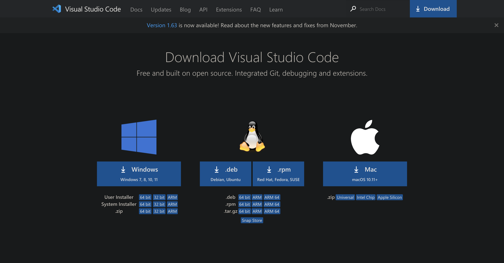
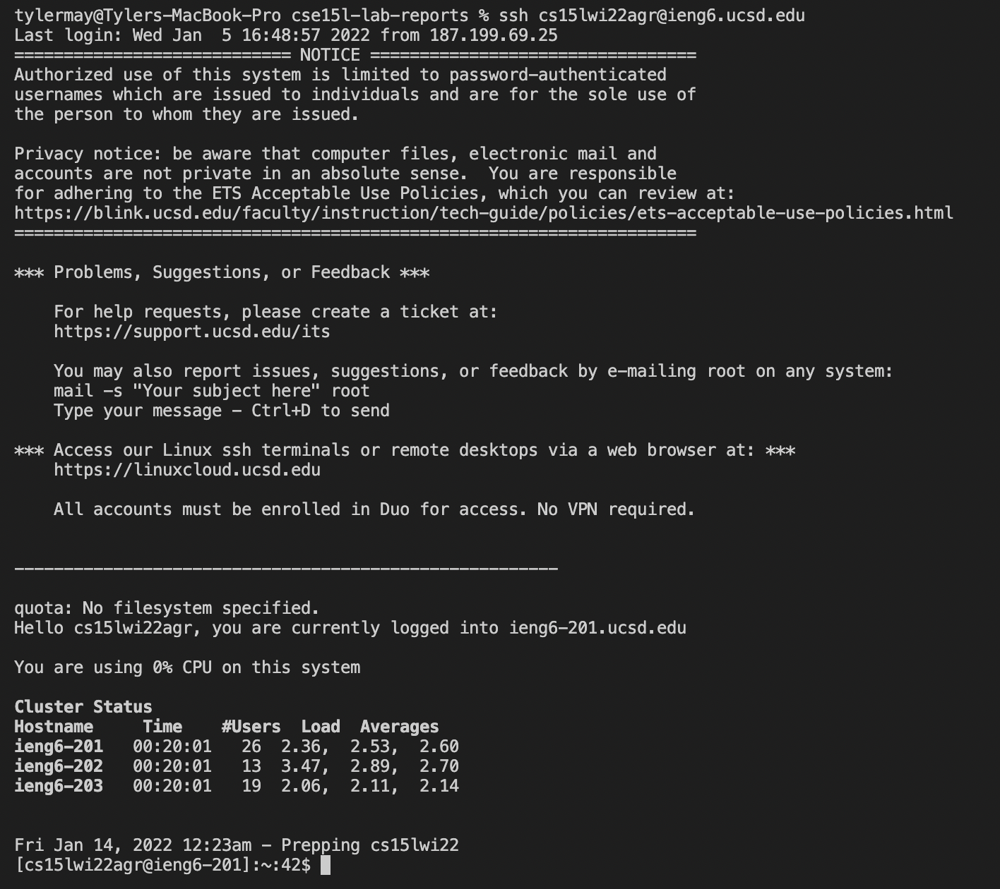
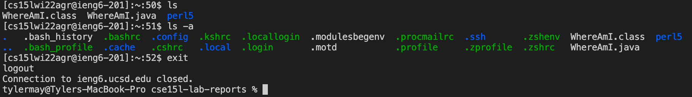
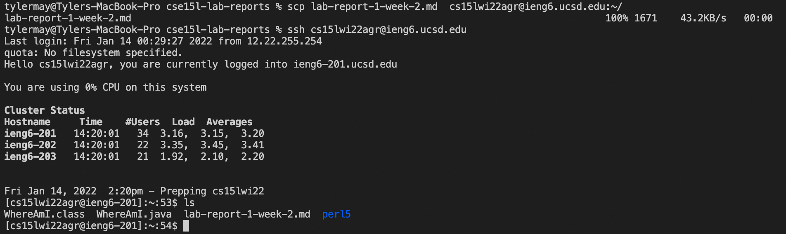
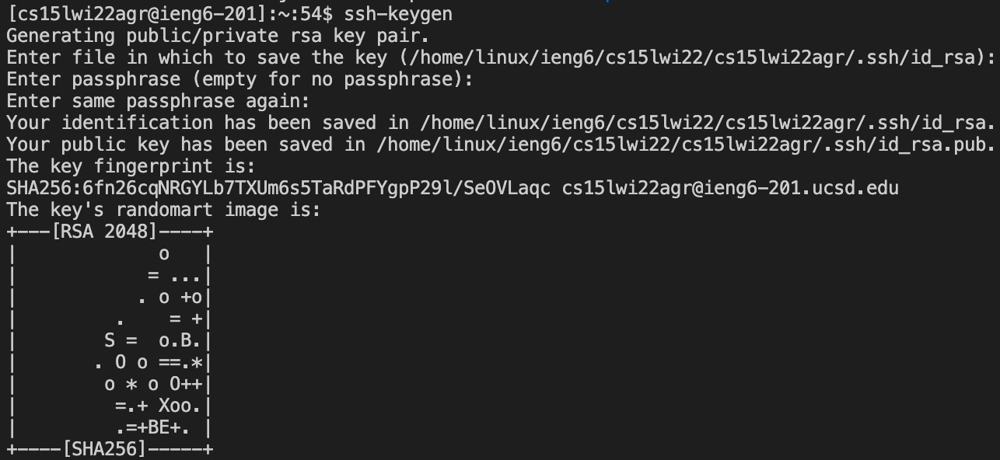
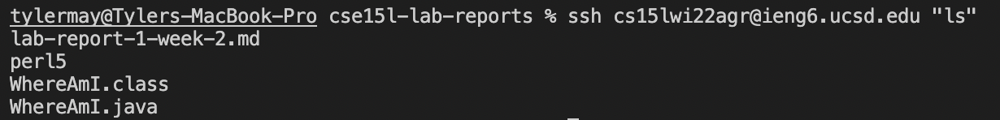

# Accessing (and using) ieng6 servers

Hello and welcome to this comprehensive tutorial! Below lies all the information one could ever for signing on to their course-specific account (so long as you are using a Macbook).

---

## Step one: Installing VSCode

This one is pretty simple, just visit [this link](https://code.visualstudio.com/download) and follow the appropriate steps for your system.



---

## Step two: Connecting to a remote server

Firstly, you need to find your [course specific ID](https://sdacs.ucsd.edu/~icc/index.php) (it should look something like `cs15lwi22___@ieng6.ucsd.edu`, with the blanks being unique to you).

Next, open terminal in VSCode and enter the code `ssh cs15lwi22___@ieng6.ucsd.edu`, with the blanks obviously replaced with your user specific code. You will be prompted for a password, which should be the same as your sign in information for your UCSD account. There's a way to remove the need for a password every time, which will be covered in a later step. 

The result should be something like this:



---

## Step three: Various commands

Now that you are actively coding on the server rather than the client, let's try out a couple of commands!

`ls` is a command that shows you all the files in your current directory. Or, at least every file that doesn't start with a " . ". If you want to truly see everything, type `ls -a`.

`cd` is a useful tool for navigating into a directory, however at this point you probably don't have any directories to navigate to.

When you're done running commands, type `exit` to return back to the client.



---

## Step four: Moving files with `scp`

`scp` is a command used to copy a file from your client to a server, and should *always be run from your client, not the server*.

The command should look something like this:

`scp YourFileHere.java cs15lwi22___@ieng6.ucsd.edu:~/`

(with the blanks and 'YourFileHere.java' obviously substituted).

Now, upon signing into the server and running `ls`, you should be able to see the newly added file.



---

## Step five: Setting an SSH Key (removing the password)

In order to bypass typing in your password every time you want to sign in, we can create a pair of public and private ssh keys, one for your computer and one for the server. By running the command `ssh-keygen`, we will create two files, `id_rsa` (the private file) and `id_rsa.pub` (the public file). **WHEN PROMPTED FOR YOUR PASSWORD, BE SURE TO JUST HIT ENTER SO NO PASSWORD WILL BE REQUIRED**. 



We can now use our recently learned tools to both create a directory entitled `.ssh` on the server and place our public key into said directory. 

Here is the example used in class to accomplish this, obviously the ID and file directory location should be replaced with your own

```
$ ssh cs15lwi22zz@ieng6.ucsd.edu
<Enter Password>
# now on server
$ mkdir .ssh
$ <logout>
# back on client
$ scp /Users/joe/.ssh/id_rsa.pub cs15lwi22@ieng6.ucsd.edu:~/.ssh/authorized_keys
# You use your username and the path you saw in the command above
```

---

## Step six: Running commands even faster

Efficiency is key when it comes to repeating tasks hundreds of times. There a couple of ways to run code in a much quicker fashion. For example,
```
$ ssh cs15lwi22___@ieng6.ucsd.edu "ls"
```
will log into the server, run the command `ls`, and then log out (all in one line of code!).



Another potentially useful tool is using semicolons to run multiple commands, such as in the example given during our lab:
```
$ cp WhereAmI.java OtherMain.java; javac OtherMain.java; java WhereAmI
```
Also, in case you were unaware, hitting the up arrow on the keyboard automatically inputs your most recent command. Hitting it multiple times will cycle through your history of commands

---
And that concludes our tutorial!