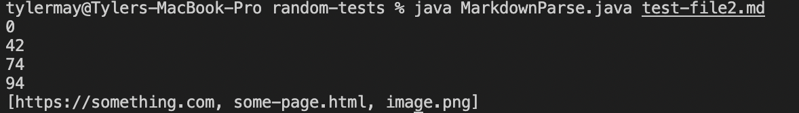

## Lab report 2 week 4

---

All code taken from Achuth Krishna's repository, who we all worked with during our lab section

# Change 1

Failure-inducing test file [here](https://github.com/AchuthKrishna/markdown-parse/commit/6615ba8d50285a3652e94de976d9008589288a74#diff-c1ee2d48f5f64b4463a98907818b5846f49cc9dd67f88882a8b551106ec320fb)

Symptom:

The program was producing 'not a link' as an item in our links list, which is obviously incorrect. To fix this, we checked to make sure that in order to be a link, the string must contain a `.` and no spaces.

---
# Change 2

Failure-inducing test file [here](https://github.com/AchuthKrishna/markdown-parse/commit/97463cffefcf6eadad3cbabef4cf84a2350b175b#diff-1f4b98282fc59090a765ed08c4defb97bb2a785c3dfc6ba5e142cb8ab14ae3b0)

Symptom:

The program was improperly iterating through the markdown file, causing multiple of the same links to be displayed. To fix this, we made sure the while loop stopped when our new variable foundParen was set to false.

---
# Change 3

Failure-inducing test file [here](https://github.com/AchuthKrishna/markdown-parse/commit/48773d48196a1087b17ef8fd72eaa285fbeed540#diff-5beb121ffd520e6643071ce4888cf5ffa8fba442dcef82572d886b8e4357035e)

Symptom:

The program was listing images as links. To fix this, code was added to check for `!` being found behind the first `[`, indicating that the following item is an image, not a link.