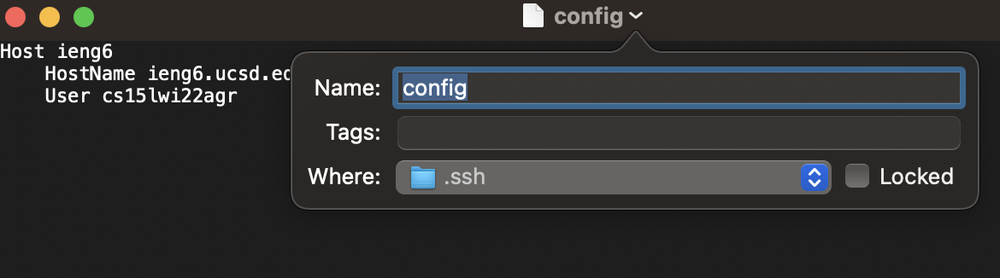
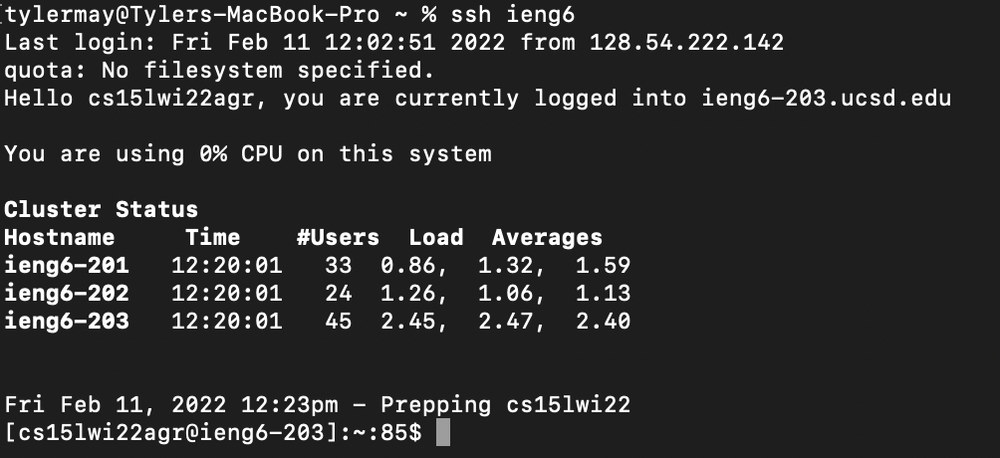
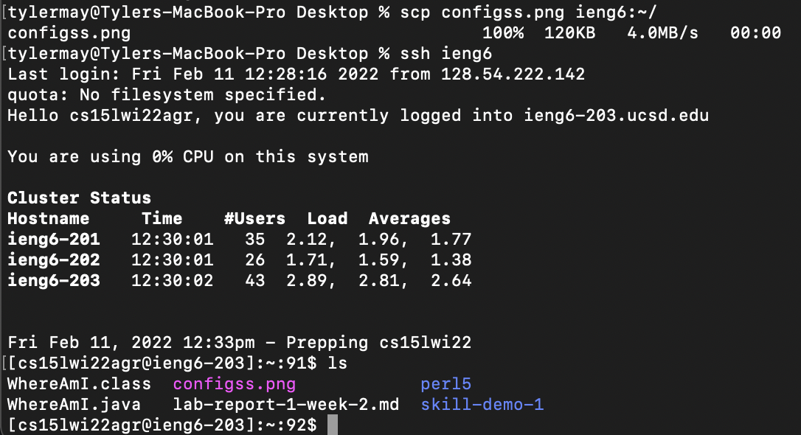

# Lab Report 3: Streamlining `ssh` Configuration

I first created an empty text file inside of my .ssh folder on my computer. Then, I opened the file using TextEdit and made the appropriate changes, using ieng6 as the shortcut.

---

Instead of typing in the lengthy host name following ssh, due to our new file we now only need to type in ieng6. In addition, we still luckily do not need to enter a password

---

In order to upload the photo to the remote server, we sill need to add `:~/` to the end of `ieng6`. This is still significantly easier than typing in `cs15lwi22agr@ieng6.ucsd.edu` every time I want to log in