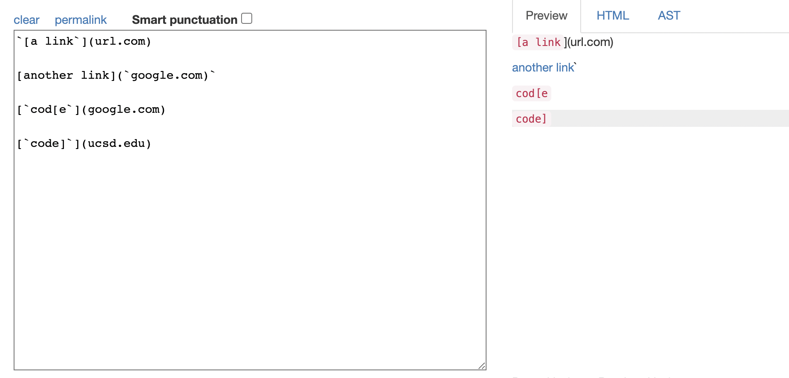
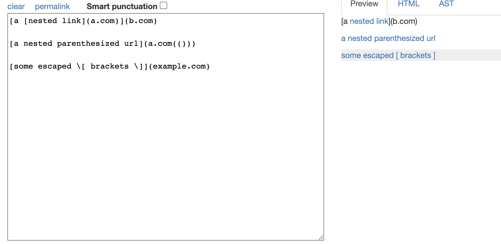
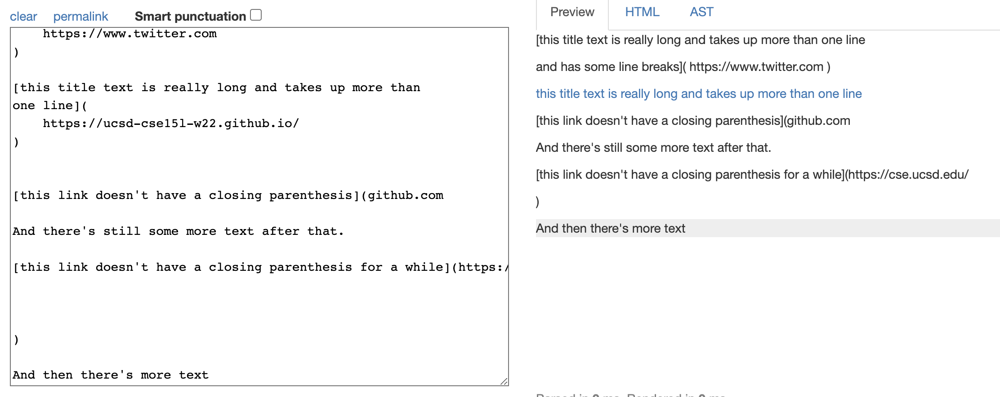
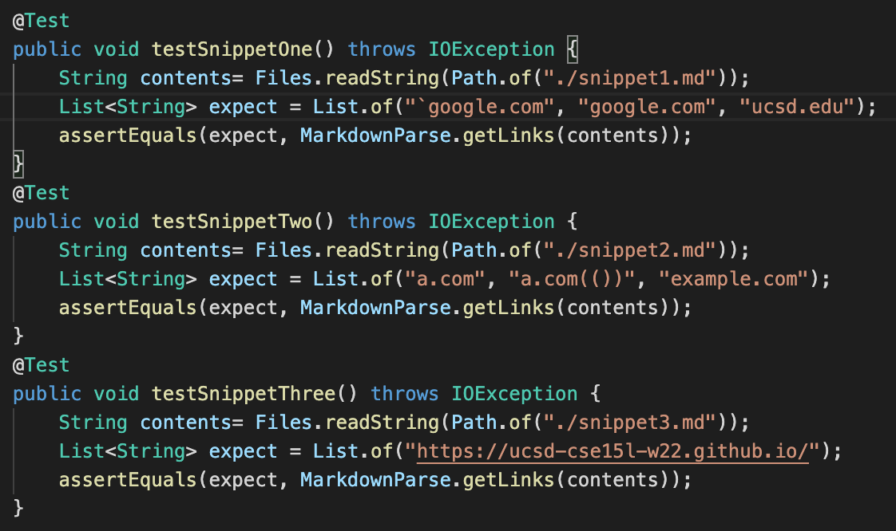
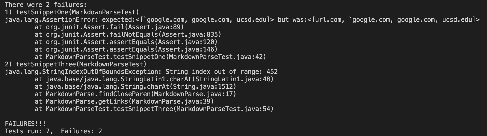
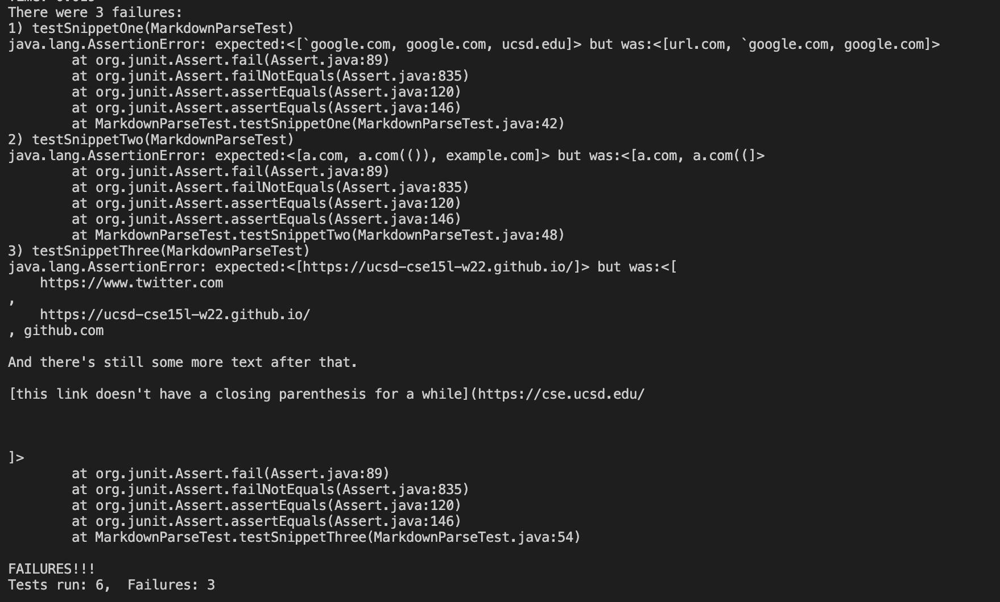

# Lab Report 4

My repository [here](https://github.com/tmay02/markdown-parse-week8)

The repository we reviewed in week 7 [here](https://github.com/yi113/markdown-parse)

---

For snippet 1, we should expect [`google.com, google.com, and ucsd.edu]

---

For snippet 2, we should expect [a.com, a.com(()), and example.com]

---

For snippet 3, we should expect [https://ucsd-cse15l-w22.github.io/]

---

Here are the three tests I ran on the three snippets:

For my implementation, the second test passed and tests 1 and 3 failed

For the implementation I reviewed, all three tests failed

---

1. **Do you think there is a small (<10 lines) code change that will make your program work for snippet 1 and all related cases that use inline code with backticks? If yes, describe the code change. If not, describe why it would be a more involved change.**

*My implementation doesn't account for backticks at all, which is the primary thing snippet 1 tests for. To fix the error, while iterating through I would make sure not to recognize open or closed parentheses/brackets that exist within backticks. This needs to be done during iteration, not beforehand, because if a link is completed before the closing of a backtick, it recognizes the link first*

2. **Do you think there is a small (<10 lines) code change that will make your program work for snippet 2 and all related cases that nest parentheses, brackets, and escaped brackets? If yes, describe the code change. If not, describe why it would be a more involved change.**

*My code actually works for this one, so no changes are needed! Perhaps more examples of similar form would break my code, but I am unable to find any at the moment*

3. **Do you think there is a small (<10 lines) code change that will make your program work for snippet 3 and all related cases that have newlines in brackets and parentheses? If yes, describe the code change. If not, describe why it would be a more involved change.**

*An `IndexOutOfBoundsException` occurred for my test of snippet 3, meaning the change likely more deeply rooted and would take more than 10 lines to fix. In order to go about fixing this, I would need to pay attention to how values are changing and recognize what makes them go out of bounds.