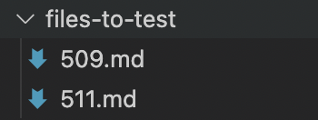
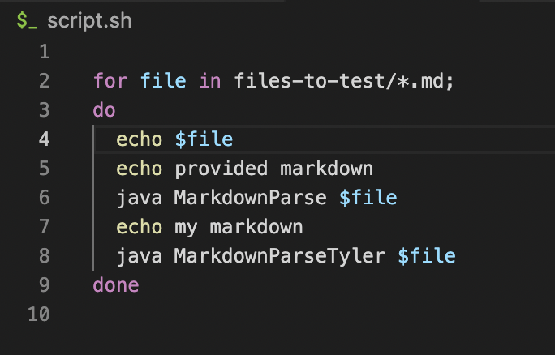
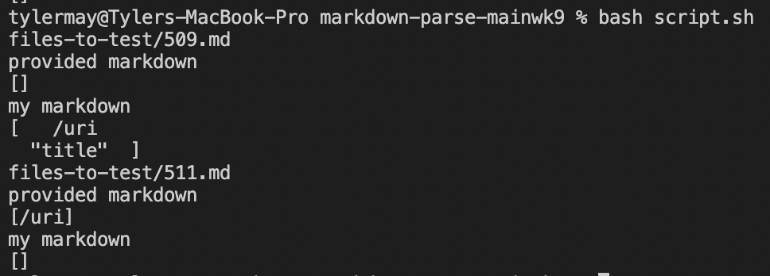
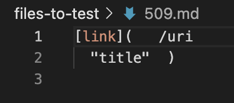
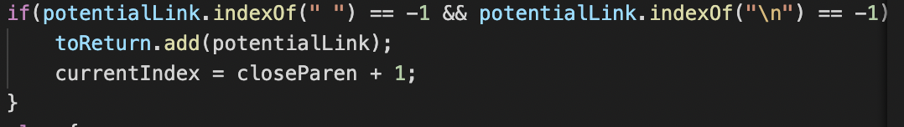
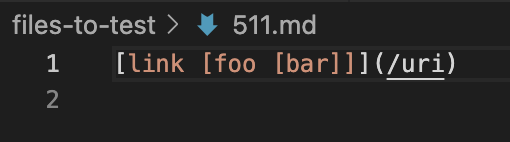
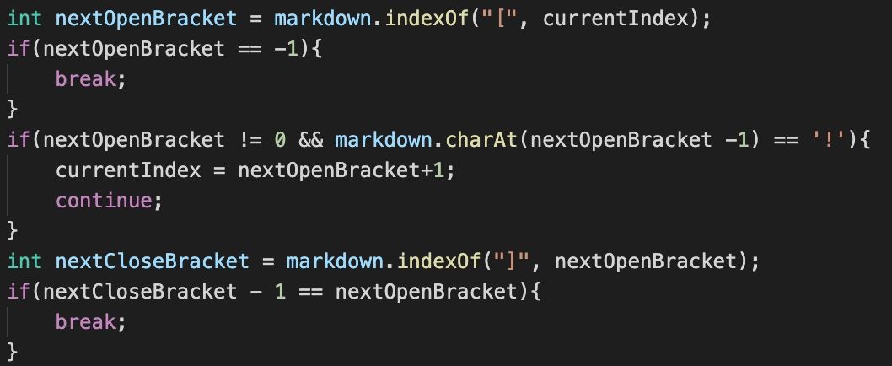

# Lab Report 5

In order to test the two different files, I first created a folder with the two .md files I intended to test entitled `files-to-test`:

I then edited and ran the following `script.sh` file

And got the following results

## Test 509

For test 509, the provided markdown file was incorrect, and my markdown file was. The expected output was exacltly what my markdown returned, whereas the other markdown returned nothing.

The primary issue in the provided implementation has to do with how spaces are checked. The searching for `" "` eliminates the issue of having a space between the closed square bracket and open parentheses, but causes the code to fail in this case

## Test 511

For test 511, the provided markdown file was correct, and my markdown file was incorrect. The expected output was the result of the provided file, and my markdown file returned nothing.

The main issue found in my implementation is how square brackets are dealt with in conjunction to parentheses, as it doesn't deal with nested square brackets properly.

